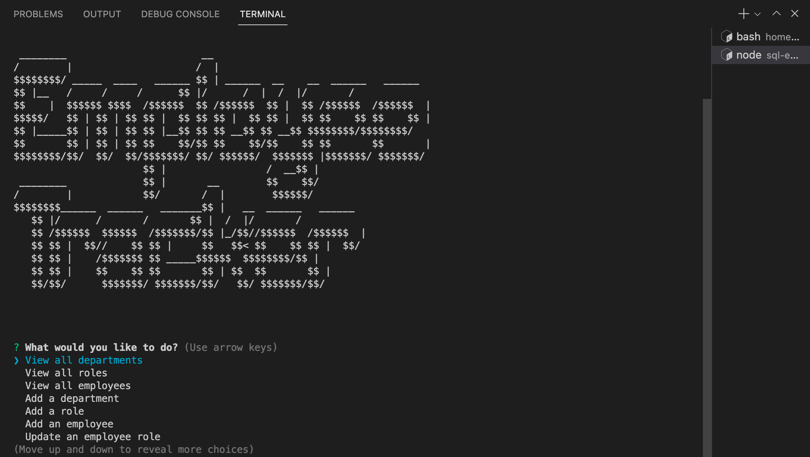

# Challenge 12: Employee Tracker

## Table of Contents

- [Overview](#overview)
  - [The Challenge](#the-challenge)
  - [User Story](#user-story)
  - [Acceptance Criteria](#acceptance-criteria)
  - [Screenshot](#screenshot)
  - [Links](#links)
- [My Process](#my-process)
  - [Built With](#built-with)
  - [What I Learned](#what-i-learned)
  - [Continued Development](#continued-development)
  - [Useful Resources](#useful-resources)
- [Author](#author)
- [Acknowledgments](#acknowledgments)

## Overview

### The Challenge

Developers frequently have to create interfaces that allow non-developers to easily view and interact with information stored in databases. These interfaces are called content management systems (CMS). Your assignment this week is to build a command-line application from scratch to manage a company's employee database, using Node.js, Inquirer, and MySQL.

Because this application won’t be deployed, you’ll also need to create a walkthrough video that demonstrates its functionality and all of the following acceptance criteria being met. You’ll need to submit a link to the video and add it to the README of your project.

### User Story
```md
AS A business owner
I WANT to be able to view and manage the departments, roles, and employees in my company
SO THAT I can organize and plan my business
```

### Acceptance Criteria

```md
GIVEN a command-line application that accepts user input
WHEN I start the application
THEN I am presented with the following options: view all departments, view all roles, view all employees, add a department, add a role, add an employee, and update an employee role
WHEN I choose to view all departments
THEN I am presented with a formatted table showing department names and department ids
WHEN I choose to view all roles
THEN I am presented with the job title, role id, the department that role belongs to, and the salary for that role
WHEN I choose to view all employees
THEN I am presented with a formatted table showing employee data, including employee ids, first names, last names, job titles, departments, salaries, and managers that the employees report to
WHEN I choose to add a department
THEN I am prompted to enter the name of the department and that department is added to the database
WHEN I choose to add a role
THEN I am prompted to enter the name, salary, and department for the role and that role is added to the database
WHEN I choose to add an employee
THEN I am prompted to enter the employee’s first name, last name, role, and manager, and that employee is added to the database
WHEN I choose to update an employee role
THEN I am prompted to select an employee to update and their new role and this information is updated in the database
```

### Screenshot



### Links

- Solution URL: [Add solution URL here](https://your-solution-url.com)
- Live Site URL: [Add live site URL here](https://your-live-site-url.com)

## My Process

### Built With

- JavaScript
- Node.js
- Express.js
- Inquirer.js
- MySQL2.js
- DOTENV
- Console.Table
- MySQL Workbench

### What I Learned


### Continued Development

In the near future, I would like to update the app so that the inquirer questions and the functions for each `.then()` statement are moved to a different file.  I believe this will help better organize the files and shorten the length of `index.js`.

I would also like to add the ability to delete roles, employees, and departments.

### Useful Resources

- [CodingStatus: How to Insert Form Data Into the Table Using Node.js and MySQL](https://codingstatus.com/how-to-insert-form-data-into-the-table-using-node-js-and-mysql/)
- [Devart: Types of SQL JOINS Explained with Examples](https://www.devart.com/dbforge/sql/sqlcomplete/sql-join-statements.html)
- [JavaScript in Plain English: How to use Inquirer.js](https://javascript.plainenglish.io/how-to-inquirer-js-c10a4e05ef1f)
- [NPM: console.table](https://www.npmjs.com/package/console.table)
- [Sports Feel Good Stories: Clue Characters, Rooms, Rules](https://www.sportsfeelgoodstories.com/clue-characters-rooms-rules/)
- [Stack Exchange: Why would a table use its primary key as a foreign key to itself](https://dba.stackexchange.com/questions/81311/why-would-a-table-use-its-primary-key-as-a-foreign-key-to-itself)
- [Stack Overflow: Conditional Prompt rendering in Inquirer?](https://stackoverflow.com/questions/56412516/conditional-prompt-rendering-in-inquirer)
- [Stack Overflow: How can I dynamically populate inquirer choices array with sql data?](https://stackoverflow.com/questions/71246678/how-can-i-dynamically-populate-inquirer-choices-array-with-sql-data)
- [Stack Overflow: How to add database environment variables to Javascript](https://stackoverflow.com/questions/45946030/how-to-add-database-environment-variables-to-javascript)
- [Stack Overflow: Inquirer.js populate list choices from sql database](https://stackoverflow.com/questions/66626936/inquirer-js-populate-list-choices-from-sql-database)
- [Stack Overflow: Return answer of inquirer prompt inside of another function](https://stackoverflow.com/questions/55959659/return-answer-of-inquirer-prompt-inside-of-another-function)
- [TutorialsPoint: SQL - INSERT Query](https://www.tutorialspoint.com/sql/sql-insert-query.htm)
- [W3Schools: MySQL Joins](https://www.w3schools.com/mysql/mysql_join.asp)
- [W3Schools: MySQL UPDATE Statement](https://www.w3schools.com/mysql/mysql_update.asp)
- [W3Schools: Node.js MySQL Insert Into](https://www.w3schools.com/nodejs/nodejs_mysql_insert.asp)
- [W3Schools: SQL INSERT INTO Statement](https://www.w3schools.com/sql/sql_insert.asp)

## Author

- GitHub - [https://github.com/anakela](https://github.com/anakela)
- LinkedIn - [https://www.linkedin.com/in/anakela/](https://www.linkedin.com/in/anakela/)

## Acknowledgments

- Fellow Bootcampers:
    - Nolan Spence
    - Nifer Kilakila
    - Ivy Chang
    - Asha Chakre
- Matthew Kaus (TA)
- Bobbi Tarkany (Tutor)
